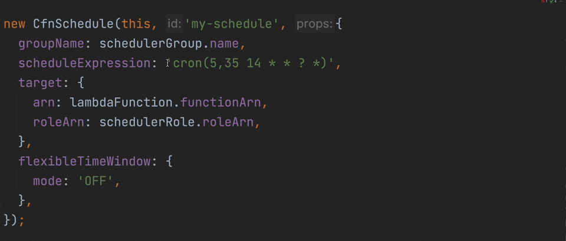
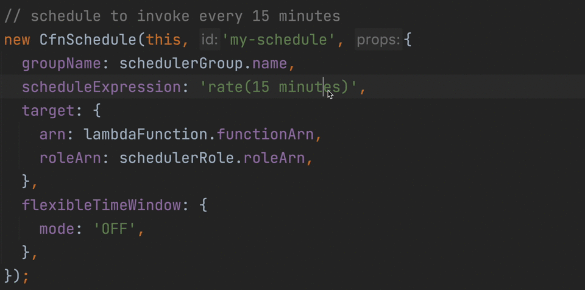

# Eventbridge Schedule Expressions


[](https://github.com/hexlabsio/eventbridge-schedule-expressions/actions/workflows/npm-package.yml)
[](https://badge.fury.io/js/%40hexlabs%2Feventbridge-schedule-expressions)

A small Typescript package that checks **[AWS EventBridge Scheduler](https://aws.amazon.com/eventbridge/scheduler/)** scheduled expressions are valid at compile time. 
Cron expressions are incredibly powerful but mistakes can be easily made. 

Typescripts type system can be used to give better validation that plain strings enforcing rules such as cron minute values are being between 0-59 while hours between 0-23

## Cron Expressions


## Rate Expressions


## Formats
Expression formats are takes from the **[AWS Schedule Expressions](https://docs.aws.amazon.com/AmazonCloudWatch/latest/events/ScheduledEvents.html)** syntax. 
Feel free to **[create an issue](https://github.com/hexlabsio/eventbridge-schedule-expressions/issues)** if you find anything that breaks these formats. 

## Installation

```shell
npm install --save-dev @hexlabs/eventbridge-schedule-expressions
```

## Usage

### [Kloudformation-ts](https://github.com/hexlabsio/kloudformation-ts)
```ts
import {scheduleExpression} from '@hexlabs/eventbridge-schedule-expressions';

aws.schedulerSchedule({
    groupName: schedulerGroup.name,
    name: 'sheduler',
    scheduleExpression: scheduleExpression('cron(0 * * * ? *)'),
    target: {arn: lambda.attributes.Arn, roleArn: schedulerRole.attributes.Arn},
    flexibleTimeWindow: {mode: 'OFF'},
  },
);
```

### CDK
```ts
import {scheduleExpression} from '@hexlabs/eventbridge-schedule-expressions';

new CfnSchedule(this, 'my-schedule', {
  groupName: schedulerGroup.name,
  scheduleExpression:  scheduleExpression('cron(5,35 * * * ? *)'),
  target: {
    arn: lambdaFunction.functionArn,
    roleArn: schedulerRole.roleArn,
  },
  flexibleTimeWindow: {
    mode: 'OFF',
  },
});
```
### AWS SDK
```ts   
  import {scheduleExpression} from '@hexlabs/eventbridge-schedule-expressions';

  await eventBridge.putRule({
    Name: 'Rule-Name',
    ScheduleExpression: scheduleExpression('cron(5,35 * * * ? *)')
  }).promise();
```